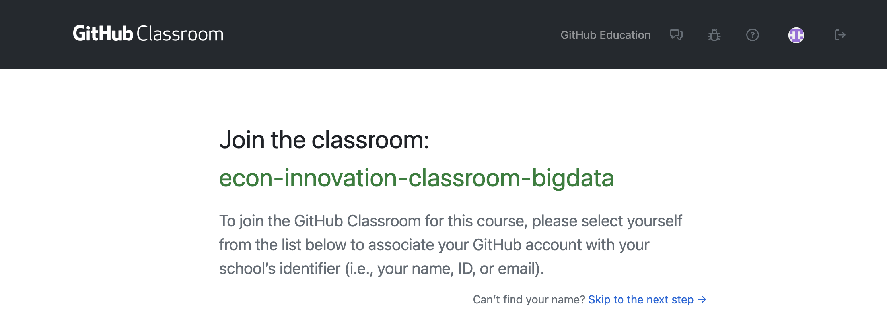
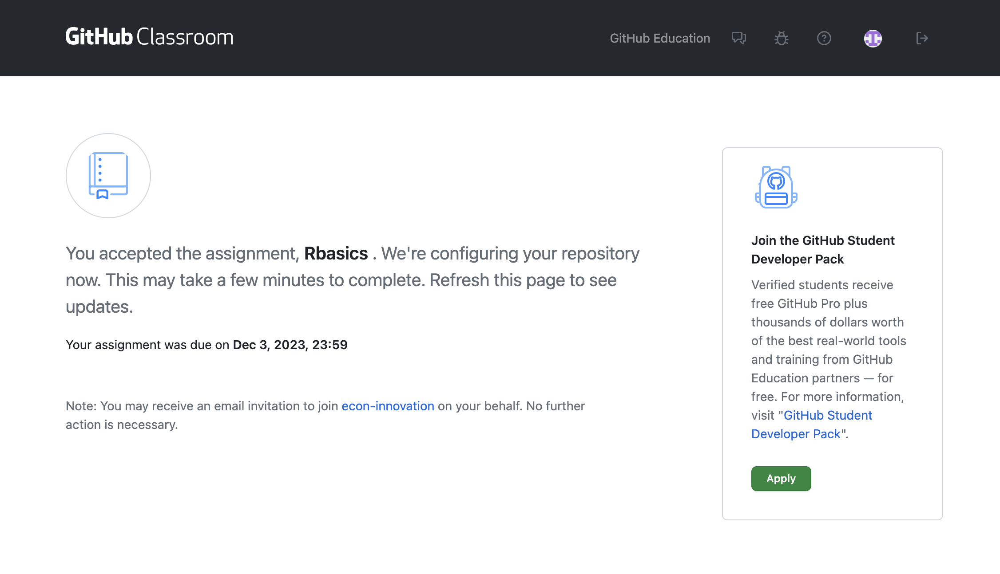
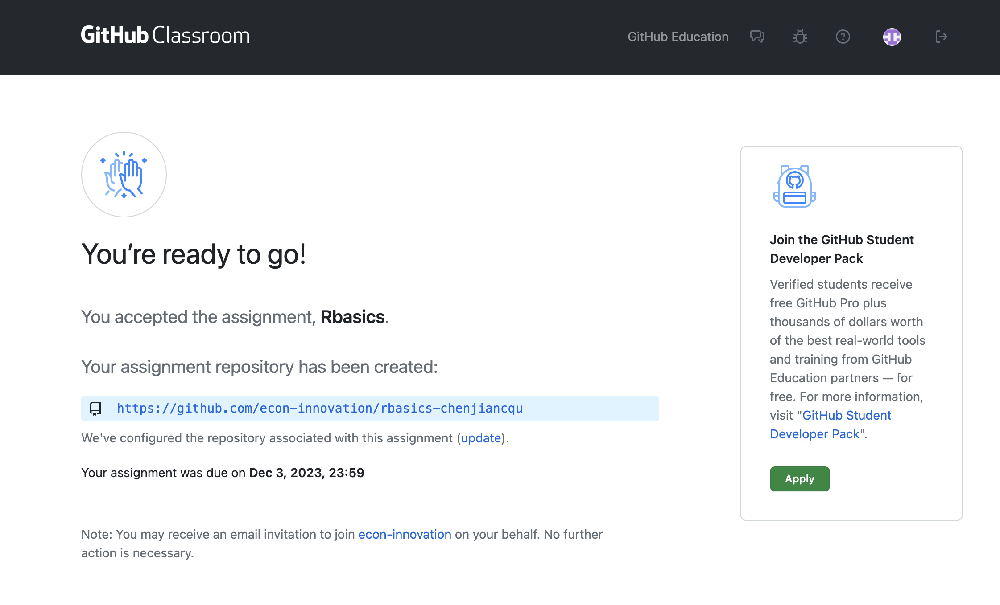
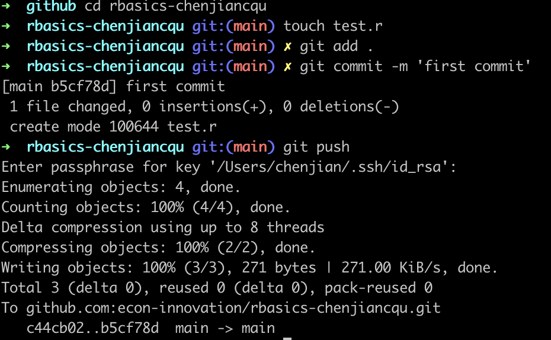
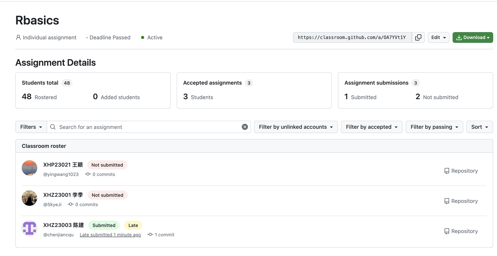
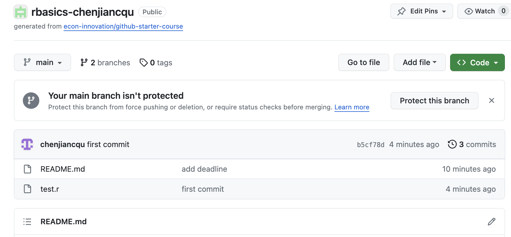

# GitHub Classroom 学生提交作业教程

本文档指导学生如何在 GitHub Classroom 中完成并提交作业。

## 接收作业

1. **通过教师提供的链接访问作业**:
   - 点击教师提供的作业链接。
2. **加入课堂**:
   - 如果尚未加入课堂，需先通过链接加入。
    

## 创建作业存储库

- **GitHub Classroom 会自动创建**:
  - 点击作业链接后，系统会自动为你创建一个对应的作业存储库。

## 克隆存储库

1. **克隆到本地**:
   - 使用 `git clone [URL]` 命令，将存储库克隆到本地电脑。

## 完成作业

1. **在本地进行作业**:
   - 在本地完成编码和文档工作。

## 提交作业

1. **添加更改到本地仓库**:
   - 使用 `git add` 命令添加所有更改。

2. **提交更改**:
   - 使用 `git commit -m "提交信息"` 命令记录你的更改。

3. **推送到 GitHub**:
   - 使用 `git push` 命令将更改推送回 GitHub。
  

## 检查提交情况

- **在 GitHub 上确认**:
  - 确认 GitHub 存储库页面上显示了所有必要的文件和更改。

## 注意事项

- **按时提交**：如果作业有截止日期，请确保在截止日期前提交。
- **多次提交**：在截止日期前，你可以多次提交作业，以更新或改进作业内容。
